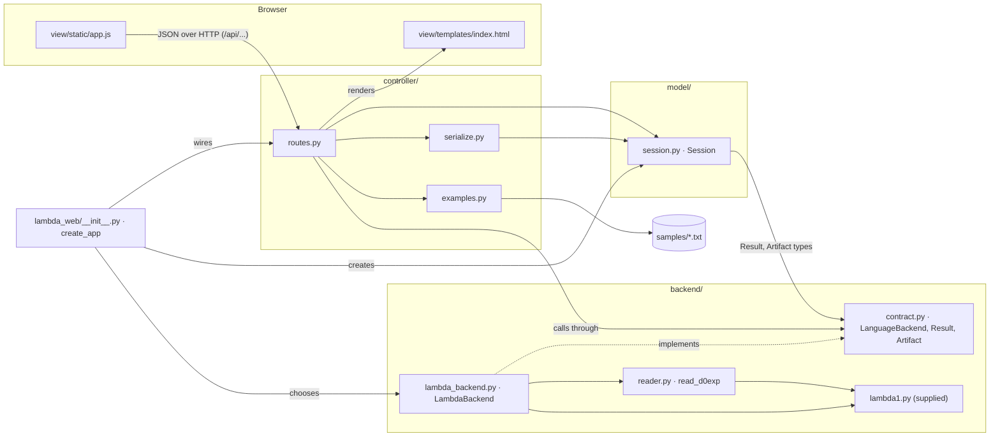
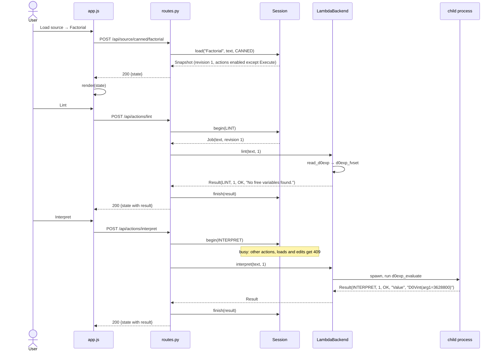

# Architecture

The LAMBDA Workbench is a local, single-user web front-end for the LAMBDA
language. It follows Model–View–Controller(MVC), with the language tools behind a
separate backend contract. Each layer depends only on the layer contracts
below it, and the boundaries are enforced by tests, not only by convention.

## Component diagram



Arrows point from a module to what it depends on. The controller knows only
the `LanguageBackend` contract; `create_app` is the single place that chooses
the concrete `LambdaBackend` (tests pass a `FakeBackend` instead).

## Responsibilities

| Role | Files | Main classes / functions | Responsibility |
| --- | --- | --- | --- |
| **Model** | `model/session.py` | `Session` (`load`, `load_upload`, `open_manual`, `edit`, `apply`, `discard`, `begin`, `finish`, `fail`, `snapshot`), `Snapshot`, `Source`, `ActionState`, `Job`, `decode_upload` | Owns the applied source and its revision, the draft, results, the artifact and the busy state. Enforces every state rule (validation, drafts block replacement, one operation at a time, per-action availability with reasons, stale results ignored) under one lock. No Flask, HTML or HTTP. |
| **View** | `view/templates/index.html`, `view/static/app.js`, `view/static/style.css` | `render(state)`, `run(label, request, describe)` | Presents the source menu, editor, controls, status and results; forwards each interaction to one API route. Copies enabled flags and reasons from the state; makes no decisions. Inserts all text with `textContent`. |
| **Controller** | `controller/routes.py`, `controller/serialize.py`, `controller/examples.py` | `action`, `_dispatch`, source routes, error handlers, `snapshot_to_dict`, `examples.get` | Translates requests into model calls, coordinates the backend (`begin` → backend → `finish`/`fail`), maps model refusals to 409/422/400/413/404, and returns the full state as JSON. Holds no rules. |
| **Backend contract** | `backend/contract.py` | `LanguageBackend`, `Operation`, `Outcome`, `Result`, `Artifact` | The interface between the application and any language tools. |
| **Backend adapter** | `backend/lambda_backend.py`, `backend/reader.py` | `LambdaBackend`, `read_d0exp` | Real Lint (`d0exp_fvset`) and Interpret (`d0exp_evaluate` in a time-limited child process); placeholder Type-check, Compile and Execute; restricted constructor reader. |
| **Composition** | `lambda_web/__init__.py`, `run.py` | `create_app(backend, session)` | Builds the app from its parts; binds to 127.0.0.1. |

## Who coordinates the backend: the controller

The model never calls the backend. To run an action, the controller asks the
model to `begin` it (the model checks availability, marks itself busy, and
returns a `Job` with the text, revision and any artifact), calls the backend
with no lock held, and hands the `Result` back with `finish`. Any exception,
from the backend or from `finish`, ends the operation with `fail`, so the
page can never stay busy.

*Why:* the model stays pure state and rules, testable without any backend,
and a five-second interpretation never holds the model's lock.
*Cost:* the controller carries a three-step protocol - it is written once, in
`action()`.

## Trace: Load source → Lint → Interpret



**Undeclared variable.** If the user edits the source to
`D0Elam("x", D0Eop2("+", D0Evar("x"), D0Evar("y")))` and applies it, the
model creates revision 2 and clears earlier results. Lint follows the same
path, but `d0exp_fvset` returns `frozenset({"y"})`, so the backend returns
`Result(LINT, 2, LANGUAGE_ERROR, "Undeclared variable(s): y")`. Nothing is
evaluated. The model records it like any other result, and the view shows it
with its outcome in words. Lint does not gate Interpret: the two are
independent, and passing Lint only means the expression is closed.

## Backend contract

```text
lint(source, revision)       -> Result
interpret(source, revision)  -> Result
typecheck(source, revision)  -> Result                       (NOT_IMPLEMENTED today)
compile(source, revision)    -> (Result, Artifact | None)    (NOT_IMPLEMENTED, None today)
execute(artifact)            -> Result                       (unreachable until an artifact exists)
```

- Every `Result` carries its `operation`, the `revision` it was computed
  for, an `outcome`, a one-line `message`, and optional text `output`.
- Outcomes: `OK`; `INPUT_ERROR` (not a valid `d0exp`); `LANGUAGE_ERROR`
  (undeclared variables, runtime failure, a `D0V000()` value even inside a
  pair); `BACKEND_FAILURE` (timeout after 5 s, recursion limit, crashed
  worker); `NOT_IMPLEMENTED`. Only `OK` counts as success.
- Failures are returned as Results, never raised. The model ignores a
  Result whose revision is no longer current.
- `Artifact(revision, format, code)` belongs to exactly one revision.

## Design decisions

**1. Interpret runs in a separate, killable process.** Each Interpret is
started in a fresh process, and is killed if it has not answered within
5 seconds. A thread cannot be stopped from outside, so an in-process
evaluation of a slow program would keep the server busy indefinitely.
*Tradeoff:* starting a process adds about 0.1 s per Interpret, and results
must be sent back between processes - in exchange, a timeout always frees the
application, and a crash in the interpreter cannot take the server down.

**2. The view renders complete state snapshots from a JSON API.** Every API
response carries the entire state, including each action's enabled flag and
the reason when it is disabled, and the script redraws the page from it.
Plain form posts would freeze the page during a five-second Interpret
(F10), and a view that tracks changes itself would have to copy the model's
rules. *Tradeoff:* the browser needs JavaScript, and each response resends
the source text (bounded at 64 KiB); in exchange, the view cannot drift from
the model, and the controller can be tested end to end without a browser.

## Replacing the placeholders

A real type checker or compiler is a new backend, or new methods on
`LambdaBackend`, behind the same contract. Neither the controller nor the
view changes; `create_app` receives the new backend.

- **Type-check** returns `OK` or `LANGUAGE_ERROR` with the type errors, like
  Lint.
- **Compile** returns `(Result, Artifact(revision, format, code))` on
  success, or `(Result, None)` on failure.
- **Reaching Execute:** `Session.finish` stores the artifact only when its
  revision matches the current source. A failed compile clears any earlier
  artifact, and any new revision clears it too. While an artifact exists for
  the current revision, the model enables Execute - `begin(EXECUTE)` hands it
  to the controller in the `Job`, and the controller passes exactly that
  artifact to `execute`, never recompiling and never falling back to
  interpretation - `execute` would run the generated code with the same
  separate-process time limit as Interpret.

This path is already exercised by tests that use a hand-made artifact
(`tests/test_model_rules.py`) and a fake compiling backend
(`tests/test_controller_actions.py`).

## View contract

The script and the tests rely on these element ids: `file-input`,
`choose-file`, `manual-input`, `source-info`, `editor`, `apply`, `discard`,
`action-<id>`, `reason-<id>`, `status`, `error`, `no-results`, `results`;
the attributes `data-load`, `data-example`, `data-action`, and the classes
`outcome-ok`, `outcome-error`, `outcome-pending`. Everything else in the
page's look can change freely - `tests/test_view_script.py` fails if an id
the script uses disappears.

## Enforced boundaries

| Boundary | Test |
| --- | --- |
| Model imports only the standard library and `backend/contract.py` | `tests/test_model.py` |
| Controller never imports `lambda1`, `reader` or `lambda_backend` | `tests/test_controller_source.py` |
| Script never inserts markup or contains language logic - talks only to `/api/` | `tests/test_view_script.py` |
| Controller works with a substituted backend, unchanged view | `tests/test_controller_actions.py` |
