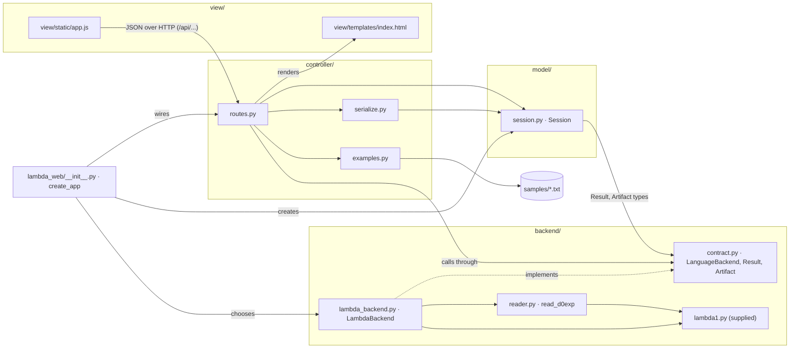
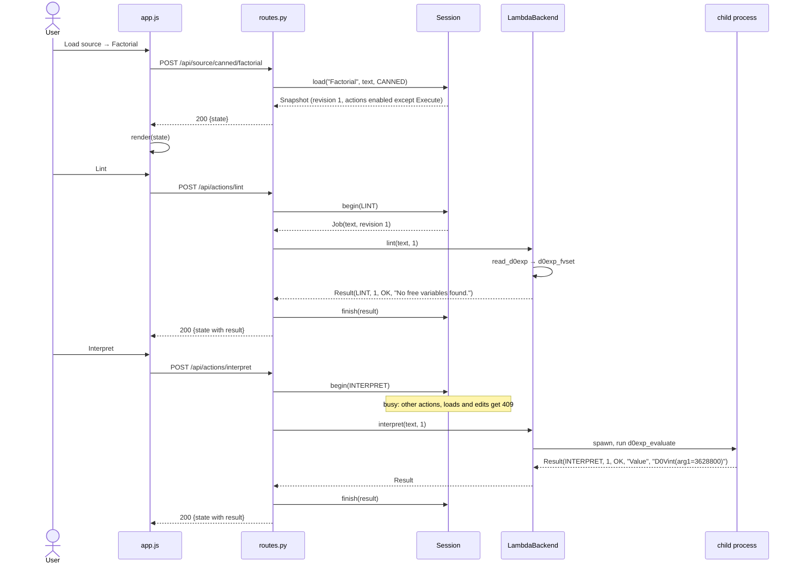

# LAMBDA Workbench Architecture

The LAMBDA Workbench is a local, single-user web front-end for the LAMBDA
language. It follows the Model–View–Controller (MVC) pattern, with the
language tools behind a separate backend contract. Each layer depends only on
the interfaces of the layers below it, and tests enforce these boundaries
rather than leaving them to convention. Setup and usage are described in
[README.md](README.md), and verification in [TESTING.md](TESTING.md).

## Component diagram



Arrows point from a module to what it depends on. The controller knows only
the `LanguageBackend` contract; `create_app` is the single place that chooses
the concrete `LambdaBackend` (tests pass a `FakeBackend` instead).

## Responsibilities

| Role | Files | Main classes / functions | Responsibility |
| --- | --- | --- | --- |
| **Model** | `model/session.py` | `Session` (`load`, `load_upload`, `open_manual`, `edit`, `apply`, `discard`, `begin`, `finish`, `fail`, `snapshot`), `Snapshot`, `Source`, `ActionState`, `Job`, `decode_upload` | Owns the applied source and its revision, the draft, results, the artifact and the busy state. Enforces every state rule under one lock: source validation, no source replacement while edits are unapplied, one operation at a time, per-action availability with reasons and rejection of stale results. Has no Flask, HTML or HTTP dependencies. |
| **View** | `view/templates/index.html`, `view/static/app.js`, `view/static/style.css` | `render(state)`, `run(label, request, describe)` | Presents the source menu, editor, controls, status and results, and forwards each interaction to one API route. Copies enabled flags and reasons from the state and makes no decisions of its own. Inserts all text with `textContent`. |
| **Controller** | `controller/routes.py`, `controller/serialize.py`, `controller/examples.py` | `action`, `_dispatch`, source routes, error handlers, `snapshot_to_dict`, `examples.get` | Translates requests into model calls, coordinates the backend (`begin` → backend → `finish`/`fail`) and returns the full state as JSON. Maps model refusals to 409 (not allowed now) or 422 (invalid source), and malformed or unknown requests to 400, 404, 405 or 413. Holds no rules. |
| **Backend contract** | `backend/contract.py` | `LanguageBackend`, `Operation`, `Outcome`, `Result`, `Artifact` | Defines the interface between the application and any language tools. |
| **Backend adapter** | `backend/lambda_backend.py`, `backend/reader.py` | `LambdaBackend`, `read_d0exp` | Implements real Lint (`d0exp_fvset`) and Interpret (`d0exp_evaluate` in a time-limited child process). Provides placeholder Type-check, Compile and Execute operations and the restricted constructor reader. |
| **Composition** | `lambda_web/__init__.py`, `run.py` | `create_app(backend, session)` | `create_app` builds the app from its parts, and `run.py` starts it on 127.0.0.1. |

## Backend coordination

The model never calls the backend. To run an action, the controller:

1. Asks the model to `begin` the action. The model checks that the action is
   available, marks itself busy and returns a `Job` holding the source text,
   its revision and any artifact.
2. Calls the backend with no lock held.
3. Hands the `Result` back to the model with `finish`.

If anything raises an exception, whether the backend or `finish`, the
controller ends the operation with `fail`, so the page never stays busy.

*Why:* the model contains only state and rules, so it can be tested without
any backend, and a 5-second interpretation never holds the model's lock.
*Tradeoff:* the controller must follow this three-step protocol, but it is
written only once, in `action()`.

## Trace: Load source → Lint → Interpret



**Undeclared variable.** If the user edits the source to
`D0Elam("x", D0Eop2("+", D0Evar("x"), D0Evar("y")))` and applies it, the
model creates revision 2 and clears earlier results. Lint follows the same
path, but `d0exp_fvset` returns `frozenset({"y"})`, so the backend returns
`Result(LINT, 2, LANGUAGE_ERROR, "Undeclared variable(s): y")`. Nothing is
evaluated. The model records it like any other result, and the view shows it
with its outcome in words. Lint does not gate Interpret: the two are
independent, and passing Lint only means the expression is closed.

## Backend contract

```text
lint(source, revision)       -> Result
interpret(source, revision)  -> Result
typecheck(source, revision)  -> Result                       (NOT_IMPLEMENTED today)
compile(source, revision)    -> (Result, Artifact | None)    (NOT_IMPLEMENTED, None today)
execute(artifact)            -> Result                       (unreachable until an artifact exists)
```

- Every `Result` carries its `operation`, the `revision` it was computed
  for, an `outcome`, a one-line `message` and optional text `output`.
- Outcomes: `OK`; `INPUT_ERROR` (not a valid `d0exp`); `LANGUAGE_ERROR`
  (undeclared variables, runtime failure, a `D0V000()` value even inside a
  pair); `BACKEND_FAILURE` (timeout after 5 s, recursion limit, crashed
  worker); `NOT_IMPLEMENTED`. Only `OK` counts as success.
- Failures are returned as `Result` objects and are never raised. The model
  ignores a `Result` whose revision is no longer current.
- `Artifact(revision, format, code)` belongs to exactly one revision.

## Design decisions

**1. Interpret runs in a separate process that can be killed.** Each
Interpret run starts in a fresh process, which is killed if it has not
answered within 5 seconds.
*Why:* a thread cannot be stopped from outside, so a slow program evaluated
inside the server process would keep the server busy indefinitely.
*Tradeoff:* starting a process adds about 0.1 s to each Interpret run, and
results must be passed back between processes. In exchange, a timeout always
frees the application, and a crash in the interpreter cannot take the server
down.

**2. The view renders complete state snapshots from a JSON API.** Every API
response carries the entire state, including each action's enabled flag and,
when an action is disabled, the reason. The script redraws the page from that
state.
*Why:* plain form posts would freeze the page during a 5-second Interpret run
(requirement F10), and a view that tracked changes itself would have to
duplicate the model's rules.
*Tradeoff:* the browser needs JavaScript, and each response resends the
source text (at most 64 KiB). In exchange, the view cannot drift out of sync
with the model, and the controller can be tested end to end without a
browser.

## Replacing the placeholders

A real type checker or compiler would be added as a new backend, or as new
methods on `LambdaBackend`, behind the same contract. Neither the controller
nor the view would change. Only `create_app` would change, to receive the new
backend.

- **Type-check** would return `OK`, or `LANGUAGE_ERROR` with the type errors,
  as Lint does.
- **Compile** would return `(Result, Artifact(revision, format, code))` on
  success, or `(Result, None)` on failure.
- **Reaching Execute:** `Session.finish` already stores an artifact only when
  its revision matches the current source. A failed compile clears any
  earlier artifact, and so does any new revision. While an artifact exists
  for the current revision, the model enables Execute. The `begin(EXECUTE)`
  call hands the artifact to the controller in the `Job`, and the controller
  passes exactly that artifact to `execute`, without recompiling or falling
  back to interpretation. The `execute` method would run the generated code
  under the same separate-process time limit as Interpret.

This path is already exercised by tests that use a hand-made artifact
(`tests/test_model_rules.py`) and a fake compiling backend
(`tests/test_controller_actions.py`).

## View contract

The script and the tests rely on these element IDs: `file-input`,
`choose-file`, `manual-input`, `source-info`, `editor`, `apply`, `discard`,
`action-<id>`, `reason-<id>`, `status`, `error`, `no-results` and `results`.
They also rely on the attributes `data-load`, `data-example` and
`data-action`, and on the classes `outcome-ok`, `outcome-error` and
`outcome-pending`. Everything else about the page's appearance can change
freely. If an ID that the script uses disappears, `tests/test_view_script.py`
fails.

## Enforced boundaries

| Boundary | Test |
| --- | --- |
| Model imports only the standard library and `backend/contract.py` | `tests/test_model.py` |
| Controller never imports `lambda1`, `reader` or `lambda_backend` | `tests/test_controller_source.py` |
| Script inserts no markup, contains no language logic and calls only `/api/` routes | `tests/test_view_script.py` |
| Controller works with a substituted backend, without any change to the view | `tests/test_controller_actions.py` |
